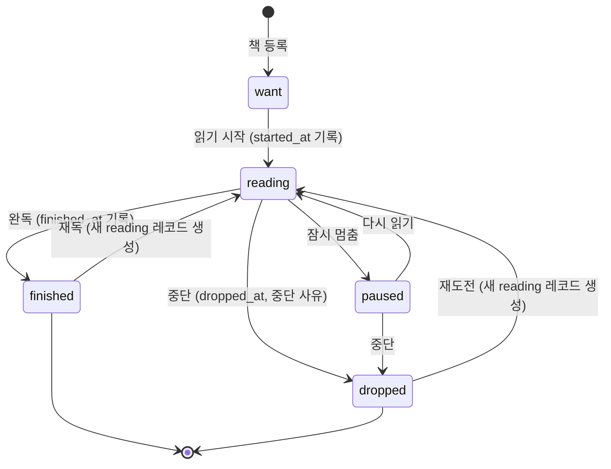
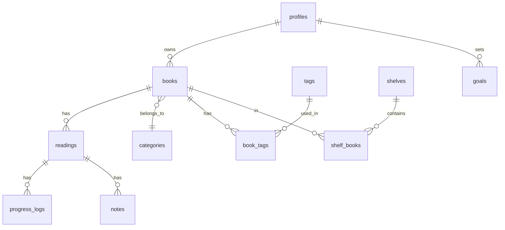

# 독서 기록 관리 웹앱 — 기획서

> 최종 수정: 2026-07-30 · 상태: 초안(v0.2) — 열린 질문 4건 확정 반영

## 1. 개요

### 1.1 한 줄 정의

읽는 책의 **진행 상태와 시간**을 기록하고, 완독 후 **짧은 소감**을 남기며, 쌓인 기록을 **분야·태그별로 되돌아볼 수 있는** 개인 독서 관리 웹앱.

### 1.2 목표

- 책 등록에 걸리는 시간을 **10초 이내**로 (제목 검색 → 선택 → 저장)
- 진행률 갱신을 **2탭 이내**로 (책 카드 → 페이지 입력)
- "올해 몇 권 읽었고, 어떤 분야에 쏠려 있는가"를 **대시보드 한 화면**에서 답하기
- PC에서 기록하고 모바일에서 확인하는 **기기 간 동기화**

### 1.3 하지 않을 것 (Non-goals)

- 다른 사용자와의 소셜 기능(팔로우, 공개 피드, 댓글) — 구조만 열어두고 구현은 보류
- 전자책 리더/뷰어 기능
- 도서 판매·구매 연동
- 추천 알고리즘

### 1.4 핵심 사용 시나리오

1. **등록**: "요즘 읽을 책" 검색 → 위시리스트에 담기
2. **시작**: 위시리스트에서 `읽기 시작` → 시작일 자동 기록, 상태 `읽는 중`
3. **기록**: 매일 밤 현재 페이지 입력(+ 읽은 시간, 한 줄 메모) → 진행률 자동 계산
4. **인용**: 인상적인 문장을 페이지와 함께 저장
5. **완독**: `완독` 처리 → 완독일 자동 기록, 별점 + 소감 작성 유도
6. **회고**: 대시보드에서 월별 권수·분야 분포·스트릭 확인, 서재에서 분야/태그로 탐색

---

## 2. 데이터 모델

### 2.1 설계 결정

**(A) `book`(책 자체)과 `reading`(한 번의 독서 시도)을 분리한다.**
같은 책을 재독하면 시작일·완독일·별점·소감이 각각 따로 남아야 하는데, 한 테이블에 두면 재독 시 이전 기록을 덮어쓰게 된다. `book` 1 : N `reading` 구조로 두면 재독·중단 후 재도전 이력이 자연스럽게 쌓인다.

**(B) 카테고리는 3층으로 나눈다.**

| 층   | 이름       | 성격                               | 예시                                                                                    |
| ---- | ---------- | ---------------------------------- | --------------------------------------------------------------------------------------- |
| 분야 | `category` | 책당 **1개**, 프리셋 + 사용자 추가 | 문학 / 인문 / 경제경영 / 과학 / 기술·IT / 자기계발 / 에세이 / 역사 / 예술 / 종교 / 실용 |
| 태그 | `tag`      | 책당 **N개**, 자유 입력            | `#SF` `#번역서` `#추천받음` `#재독예정`                                                 |
| 서재 | `shelf`    | 사용자가 임의로 묶는 컬렉션        | "2026 상반기", "회사 스터디", "언젠가는"                                                |

분야는 통계 축(파이 차트)이라 반드시 단일 선택이어야 하고, 태그는 검색 축이라 다중이어야 한다. 이 둘을 하나로 합치면 통계가 망가진다.

**(C) 진행률 단위는 `percent`(전자책 기본)와 `page`(종이책) 두 가지만 둔다.**
주 사용 형태가 전자책이므로 기본 단위는 **%**다. 전자책 리더는 앱마다 페이지 표기가 달라 페이지 기반 진행률이 신뢰할 수 없고, 그 결과 **페이지수(`total_pages`)는 종이책에서만 필수**다. 오디오북은 쓰지 않으므로 `minute` 단위는 제외한다(단, 읽은 **시간** 기록은 형태와 무관하게 유지).

이 결정의 파급:

- 통계의 주 지표는 **권수 + 독서 시간(분)**. "총 페이지"는 종이책 한정 보조 지표로만 표시한다. 전자책이 대부분인 상태에서 총 페이지를 대표 지표로 쓰면 실제 독서량을 왜곡한다.
- 외부 API에서 페이지수를 못 얻어도 등록·진행률 기록이 전혀 막히지 않는다 → 알라딘 연동 우선순위 하락(§6 참조).

### 2.2 상태 전이



- `want`(위시리스트)는 `book`의 속성이 아니라 **reading 없이 book만 존재하는 상태**로 표현할 수도 있으나, 조회 단순화를 위해 `reading` 레코드를 상태 `want`로 미리 만든다.
- `finished`/`dropped`에서 다시 읽으면 기존 레코드는 **수정하지 않고** 새 `reading`을 만든다. `reading.attempt_no`로 1회독/2회독을 구분.

### 2.3 스키마 (PostgreSQL / Supabase)



> **정본은 [`supabase/migrations/0001_init.sql`](../supabase/migrations/0001_init.sql)이다.** 아래는 요약이고, 컬럼 정의·제약·RLS 정책의 실제 내용은 마이그레이션 파일을 본다. SQL을 두 곳에 두면 반드시 어긋난다.

| 테이블                    | 역할                                                                 |
| ------------------------- | -------------------------------------------------------------------- |
| `profiles`                | `auth.users` 1:1 확장. 가입 트리거가 자동 생성                       |
| `categories`              | 분야(단일 선택). 가입 시 프리셋 12종을 **사용자 소유 행으로 복사**   |
| `books`                   | 도서 마스터. 형태 기본값 `ebook`                                     |
| `readings`                | 독서 시도 1건. 재독하면 `attempt_no + 1` 행을 추가                   |
| `progress_logs`           | 진행 기록. 스트릭·속도·히트맵의 원천 데이터                          |
| `notes`                   | 인용 / 생각 / 질문. `location` 단위는 소속 reading의 `progress_unit` |
| `tags` · `book_tags`      | 자유 태그(다중)                                                      |
| `shelves` · `shelf_books` | 임의 컬렉션                                                          |
| `goals`                   | 연간/월간 목표. `metric` = `books` \| `minutes`                      |

**스키마가 강제하는 규칙**

- **RLS 전 테이블 활성화.** `user_id = (select auth.uid())` 단일 조건. 조인 테이블(`book_tags`, `shelf_books`)은 `user_id`를 두지 않고 부모의 소유권을 `exists`로 따라간다.
- 소감 500자 · 별점 0.5 배수 · ISBN13 13자리 · 색상 `#rrggbb` · 목표 기간키 `2026`/`2026-07`
- `percent` 단위면 `target_value = 100`, `page` 단위면 `target_value` 필수
- 상태-날짜 정합성: `finished` ↔ `finished_at`, `dropped` ↔ `dropped_at`, `want`이 아니면 `started_at` 필수
- **`record_progress()` RPC**가 `progress_logs` insert와 `readings.current_value` 갱신을 한 트랜잭션으로 묶는다. 완독/중단 상태에는 기록을 거부하고, `want`/`paused`에서 기록하면 `reading`으로 승격한다. 100%에 도달해도 **완독 판정은 하지 않는다**(§2.2).

**PRD 초안에서 바뀐 점** (W2 · G1 승인 · 2026-07-30)

1. **분야 프리셋을 전역 공유 → 사용자별 복사.** 전역 행이면 프리셋 12종만 이름·색상·순서를 못 고쳐 W8의 분야 편집과 어긋난다. 사용자 소유 행으로 두면 RLS도 단일 조건으로 통일된다.
2. **종이책 페이지수 필수를 `books` → `readings`로 이동.** 위시리스트에 담는 시점엔 분량을 모를 수 있다. 실제 요구는 "페이지 단위로 기록하려면 분량이 있어야 한다"이므로 `progress_unit = 'page'`일 때만 강제한다.
3. **`notes.page` → `notes.location`.** 전자책은 인용 위치가 %다.
4. **프리셋 시드에 색상을 넣지 않는다.** `color = null`이면 앱이 팔레트에서 배정하고, 값이 있으면 사용자 지정이다. DB 시드에 hex를 박으면 팔레트 교체가 데이터 마이그레이션이 된다.
5. **`auth.users → profiles` 트리거를 W3 → W2로 이동.** DB 객체는 스키마 단위에 모아야 마이그레이션이 하나로 끝난다.
6. **`goals.metric`에서 `pages` 제거** (§3.1 F10에서 이미 결정).

### 2.4 파생 값 (저장하지 않고 계산)

- `progress_percent` = `current_value / target_value * 100`
- `완독 소요일` = `finished_at - started_at`
- `일일 평균 페이지` = 진행 기록 합 / 기록한 날 수
- `예상 완독일` = 남은 분량 / 최근 7일 평균 속도
- `스트릭` = `progress_logs.logged_on`의 연속 일수

---

## 3. 기능 명세

### 3.1 MVP (v1.0) — 이것만 되면 매일 쓸 수 있다

| #   | 기능                       | 상세                                                                                                                                                                                                                 |
| --- | -------------------------- | -------------------------------------------------------------------------------------------------------------------------------------------------------------------------------------------------------------------- |
| F1  | 도서 검색·등록             | 제목/저자/ISBN으로 외부 API 검색 → 결과 선택 시 필드 자동 채움 → 수정 후 저장. 검색 결과 없으면 수동 등록 폼                                                                                                         |
| F1b | **이미 읽은 책 소급 등록** | 등록 시 "이미 다 읽은 책" 선택 → 완독 시기(**년-월**) · 별점 · 소감을 함께 입력하면 바로 완독 상태로 생성. 통계·서재 연도 필터에 반영된다. 앱을 쓰기 전에 읽은 책이 없으면 통계가 의미를 갖지 못한다                 |
| F2  | 상태 관리                  | `want → reading → finished/dropped/paused` 전이. 상태 변경 시 날짜 자동 기록(수정 가능)                                                                                                                              |
| F3  | 진행률 기록                | 전자책은 **%**, 종이책은 **페이지** 입력 → 진행률 바 갱신. 기록은 `progress_logs`에 누적. 단위는 `format`에 따라 자동 결정(수동 변경 가능)                                                                           |
| F4  | 독서 시간                  | 진행 기록 입력 시 "읽은 시간(분)" 수동 입력                                                                                                                                                                          |
| F5  | 소감·별점                  | 별점(0.5 단위) + **한 줄 소감**(평문 textarea 2~3줄, 500자 제한, 마크다운 없음). 완독 처리 시 별점·소감을 한 모달에서 함께 입력                                                                                      |
| F6  | 인용구                     | 문장 + 위치(페이지 또는 %) 저장, 즐겨찾기                                                                                                                                                                            |
| F7  | 분야/태그                  | 분야 단일 선택(프리셋 12종 + 추가), 태그 다중 자유 입력                                                                                                                                                              |
| F8  | 서재 목록·필터             | 상태 탭(전체/읽는 중/완독/위시리스트/중단) + 분야·태그·별점·연도 필터 + 키워드 검색 + 정렬(최근 업데이트/완독일/별점/제목). 그리드(표지) / 리스트 뷰 전환. 소감이 짧으므로 **리스트 뷰에서 소감 전문을 그대로 노출** |
| F9  | 대시보드                   | 올해 완독 권수, 읽는 중 목록, 목표 달성률, 월별 완독 추이(바), 분야 분포(도넛), 스트릭, 총 독서 시간                                                                                                                 |
| F10 | 목표                       | 연간/월간 목표 설정 및 진행률. 지표는 **권수 또는 시간(분)** (페이지는 제외 — 전자책 비중 탓에 의미가 없음)                                                                                                          |
| F11 | 인증·동기화                | 이메일 매직링크 로그인, 사용자별 데이터 격리(RLS)                                                                                                                                                                    |
| F12 | 반응형 + 다크모드          | 모바일 우선 레이아웃, OS 테마 연동. 테마 선택은 4개 — 시스템(=OS 연동, 기본) / 라이트 / 다크 / **세피아**. 세피아는 밝지도 어둡지도 않은 미색 종이톤으로, OS에 짝이 없어 직접 골라야만 켜진다                        |

### 3.2 v1.1 — 쓰다 보면 아쉬워지는 것

| #   | 기능                     | 상세                                                                                    |
| --- | ------------------------ | --------------------------------------------------------------------------------------- |
| F13 | 독서 타이머              | 시작/일시정지/종료 → 자동으로 `minutes` 기록. 탭을 닫아도 유지(로컬 저장 + 서버 동기화) |
| F14 | 독서 히트맵              | GitHub 잔디형 연간 캘린더 (일별 읽은 페이지/분)                                         |
| F15 | 데이터 내보내기/가져오기 | JSON 전체 백업, CSV 내보내기(도서 목록/완독 목록)                                       |
| F16 | PWA                      | 홈 화면 추가, 오프라인 조회(읽기 전용 캐시)                                             |
| F17 | 반납일 알림              | 도서관 대출 반납일 D-3 배너                                                             |
| F18 | 통계 심화                | 저자별 권수, 별점 분포, 평균 완독 소요일, 분야별 평균 별점, 요일·시간대별 독서 패턴     |
| F19 | 알라딘 페이지수 보강     | 종이책 등록 시 ISBN13으로 페이지수 자동 조회. MVP에서는 수동 입력이므로 후순위          |

### 3.3 v1.2+ — 있으면 좋은 것

- **F20 ISBN 바코드 스캔** — 종이책 등록용. 모바일 카메라 + `BarcodeDetector` API(미지원 브라우저는 폴백 라이브러리). 전자책 위주라 우선순위는 중간
- **F21 기록 공유 카드** — 완독 기록(표지 + 별점 + 한 줄 소감)을 이미지로 렌더링해 저장/공유. 소감이 짧아서 카드 레이아웃에 잘 맞는다
- **F22 시리즈 관리** — 시리즈물 묶음 및 다음 권 안내
- **F23 명령 팔레트** — `Cmd+K`로 책 검색·상태 변경
- **F24 연간 리포트** — "2026 나의 독서" 요약 페이지
- **F25 공개 프로필** — 선택한 소감만 공개 URL로 (Non-goal에서 승격 시)

---

## 4. 화면 설계

| 라우트        | 화면          | 핵심 요소                                                                                                                            |
| ------------- | ------------- | ------------------------------------------------------------------------------------------------------------------------------------ |
| `/`           | 대시보드      | 읽는 중 카드(진행률 바 + 빠른 기록 버튼), 목표 게이지, 월별 추이, 분야 도넛, 최근 인용구                                             |
| `/library`    | 서재          | 상태 탭 + 필터 사이드바 + 그리드/리스트. **전량 로드 후 클라이언트 필터링**(§5 참조) — 위시리스트도 별도 화면 없이 이 탭 하나로 처리 |
| `/books/[id]` | 도서 상세     | 표지·서지정보, 회독 탭(1회독/2회독), 진행 타임라인, 소감, 인용구 목록                                                                |
| `/books/new`  | 도서 등록     | 검색 모드 ↔ 수동 입력 모드 토글                                                                                                      |
| `/notes`      | 노트 모아보기 | 전체 인용구/생각을 책·태그로 필터, 랜덤 1개 보기                                                                                     |
| `/stats`      | 통계          | 히트맵, 심화 차트                                                                                                                    |
| `/settings`   | 설정          | 분야 관리, 태그 정리, 목표, 백업/복원, 테마                                                                                          |
| `/login`      | 로그인        | 매직링크                                                                                                                             |

**빠른 기록 인터랙션**: 대시보드의 읽는 중 카드에서 `+` → 인라인 숫자 입력 → Enter. 페이지 이동 없이 낙관적 업데이트(optimistic update).

---

## 5. 기술 아키텍처

```
[브라우저]
   │  Next.js App Router (RSC)
   ├─ Server Component: 목록/상세 조회 (Supabase 서버 클라이언트)
   ├─ Server Action:    생성/수정/삭제 (revalidateTag)
   └─ Client Component: 필터, 차트, 타이머, 낙관적 진행률
   │
   ├─→ /api/book-search  (Route Handler, 외부 API 키를 서버에만 보관)
   │        └─→ 카카오 책 검색 API → (선택) 알라딘 상품조회로 페이지수 보강
   │
   └─→ Supabase
          ├─ Postgres + RLS
          ├─ Auth (이메일 매직링크)
          └─ Storage (직접 업로드한 표지 이미지)
```

| 영역       | 선택                                          | 이유                                                                         |
| ---------- | --------------------------------------------- | ---------------------------------------------------------------------------- |
| 프레임워크 | Next.js 16 App Router + React 19 + TypeScript | 서버에서 데이터 조회 → 목록 화면이 빠르고, 외부 API 키를 서버에 숨길 수 있음 |
| 스타일     | Tailwind CSS + shadcn/ui                      | 모달·시트·드롭다운을 직접 만들지 않아도 됨                                   |
| DB/인증    | Supabase                                      | Postgres + Auth + Storage + RLS를 한 번에. 기기 간 동기화 요구사항 충족      |
| 차트       | Recharts                                      | 도넛/바/산점도 커버, RSC 밖 클라이언트 컴포넌트로 격리                       |
| 폼         | React Hook Form + Zod                         | Zod 스키마를 Server Action 검증에 재사용                                     |
| 배포       | Vercel                                        | Next.js와 정합성, 무료 티어로 충분                                           |

**규칙**

- 서버 액션은 항상 Zod로 입력 검증 후 Supabase 호출. 클라이언트 검증만 믿지 않는다.
- 진행률 갱신은 `progress_logs` insert + `readings.current_value` 갱신을 하나의 DB 함수(RPC)로 묶어 원자적으로 처리.
- **서재는 페이지네이션하지 않는다.** 위시리스트가 수십 권, 전체 장서가 수백 권 규모이므로 목록 전체(표지 URL·제목·상태·진행률 등 카드 표시용 필드만)를 한 번에 받아 클라이언트에서 필터·정렬·검색한다. 무한 스크롤/커서 로직이 사라지고 필터 전환이 즉각 반응한다. 도서가 1,000권을 넘어가면 그때 서버 필터링으로 전환.
- 표지 이미지는 외부 URL을 그대로 쓰되, `next/image`의 `remotePatterns`에 허용 도메인 등록. 사용자 업로드분만 Storage.

---

## 6. 외부 API 연동

### 6.1 검토 결과

| API                                                              | 용도                                   | 비고                                                                                                                                                                                                                                                                                                                                                 |
| ---------------------------------------------------------------- | -------------------------------------- | ---------------------------------------------------------------------------------------------------------------------------------------------------------------------------------------------------------------------------------------------------------------------------------------------------------------------------------------------------- |
| **카카오 책 검색** (`GET https://dapi.kakao.com/v3/search/book`) | **MVP 유일 소스**                      | 키 발급 간단(REST API 키, `Authorization: KakaoAK {key}`), 응답에 제목·저자·역자·출판사·ISBN·썸네일·출간일 포함. **페이지수는 제공하지 않음 — W4에서 실측 확인**(2026-07-30, 문서 필드 12개: `authors, contents, datetime, isbn, price, publisher, sale_price, status, thumbnail, title, translators, url`). 재확인은 `node scripts/probe-kakao.mjs` |
| **알라딘 OpenAPI** (ItemLookUp)                                  | 종이책 페이지수 보강 — **v1.1로 이월** | TTBKey 필요. 상품조회 부가정보로 페이지수를 받을 수 있는 것으로 알려져 있으나 **실제 응답 필드는 구현 시 검증 필요**. 확인 결과 못 얻으면 페이지수는 수동 입력 전용으로 확정하고 이 연동을 폐기                                                                                                                                                      |
| 국립중앙도서관 서지정보                                          | 백업 소스                              | 절판·희귀 도서 커버리지 보완용, 우선순위 낮음                                                                                                                                                                                                                                                                                                        |

전자책이 주력이라 진행률을 %로 기록하므로, **페이지수는 종이책에서만 필요한 선택 값**이 되었다. 따라서 MVP는 카카오 단일 소스로 가고 외부 API를 하나만 다룬다.

### 6.2 등록 플로우 (MVP)

1. 사용자가 제목 입력 → `/api/book-search?q=...` → 카카오 결과 10건 표시(표지 썸네일 포함)
2. 항목 선택 → 서지정보 자동 입력, 형태는 **전자책**이 기본 선택
3. 형태를 **종이책**으로 바꾼 경우에만 페이지수 입력 필드가 나타남 (미입력 시 % 기록으로 폴백하고 등록은 막지 않음)
4. 저장 시 `source_ref`에 원본 응답 요약 보관

### 6.3 대비

- 외부 API 장애/쿼터 초과 시 검색 UI에 에러 배너 + 수동 등록 폼으로 즉시 전환 (등록 자체가 막히면 안 됨)
- 검색 결과는 Next.js `revalidate` 캐시로 동일 쿼리 재호출 절감

---

## 7. 구현 마일스톤

| 단계   | 내용                  | 산출물                                                                                          |
| ------ | --------------------- | ----------------------------------------------------------------------------------------------- |
| **M0** | 프로젝트 셋업         | Next.js + TS + Tailwind + shadcn, Supabase 프로젝트, 마이그레이션 SQL, 분야 프리셋 시드, 로그인 |
| **M1** | 도서 CRUD + 검색 연동 | `/books/new`, `/books/[id]`, 상태 전이 (F1·F2)                                                  |
| **M2** | 진행률·타임라인       | 진행 기록 RPC, 진행률 바, 빠른 기록 (F3·F4)                                                     |
| **M3** | 소감·인용구           | 완독 모달, 별점, 마크다운 리뷰, 노트 (F5·F6)                                                    |
| **M4** | 분류·탐색             | 분야/태그/서재, 서재 필터·검색·정렬 (F7·F8)                                                     |
| **M5** | 대시보드·목표         | 통계 쿼리(SQL view), 차트, 목표 (F9·F10)                                                        |
| **M6** | 마감                  | 다크모드, 반응형 점검, PWA, 백업/복원, 히트맵 (F12·F14~F16)                                     |

M1~M3이 끝나는 시점부터 실제로 자기 기록을 넣기 시작하는 걸 권장한다. 더미 데이터로는 필터·통계의 필요성이 안 보인다.

---

## 8. 확정된 결정 사항

| #   | 질문                 | 결정                                        | 설계 반영                                                                                                                                                                                        |
| --- | -------------------- | ------------------------------------------- | ------------------------------------------------------------------------------------------------------------------------------------------------------------------------------------------------ |
| 1   | 소감의 길이          | **한 줄 ~ 몇 줄**. 장문 서평 없음           | 마크다운 에디터·렌더러 제거 → 평문 textarea + 500자 DB 제약. 별점·소감을 완독 모달 한 화면에서 입력. 짧으므로 서재 리스트 뷰에 소감 전문 노출 (§3.1 F5·F8)                                       |
| 2   | 형태 비중            | **거의 전자책**, 일부 종이책. 오디오북 없음 | `progress_unit`은 `percent`(기본)·`page` 두 개로 축소, `minute` 제거. `total_pages`는 종이책 전용 선택 값. 통계 주 지표를 권수+시간으로 전환, 총 페이지는 종이책 보조 지표 (§2.1 C, §3.1 F3·F10) |
| 3   | 위시리스트 규모      | **수십 권**                                 | 별도 화면 분리 안 함 → 서재의 상태 탭 하나. 전체 규모가 수백 권이므로 페이지네이션·무한 스크롤 삭제, 전량 로드 + 클라이언트 필터링 (§4, §5)                                                      |
| 4   | 알라딘 페이지수 필드 | M1에서 실응답 검증 후 판단                  | 페이지수 의존도가 낮아졌으므로 MVP는 **카카오 단일 소스**, 알라딘 보강은 v1.1(F19). 검증 실패 시 해당 연동 폐기하고 수동 입력 확정 (§6)                                                          |

### 추가된 결정 (2026-08-01 · W13.5)

| #   | 질문                         | 결정                                     | 설계 반영                                                                                                                                                                    |
| --- | ---------------------------- | ---------------------------------------- | ---------------------------------------------------------------------------------------------------------------------------------------------------------------------------- |
| 5   | 이미 읽은 책을 어떻게 넣는가 | **등록 화면에서 완독까지 한 번에** (F1b) | 별도 화면을 만들지 않는다. `/books/new`에 체크박스 하나를 두고 켜면 완독 시기·별점·소감이 나타난다                                                                           |
| 6   | 완독 시기를 어디까지 받는가  | **년-월까지만**                          | 몇 년 전 책의 날짜를 정확히 기억하는 사람은 없고, 통계가 쓰는 축도 연도·월뿐이다. `finished_at`에 그 달 1일 서울 자정으로 저장한다 — **스키마 변경 없음**                    |
| 7   | 시작일과 독서 시간은         | **시작일 = 완독 시점, 독서 시간은 0**    | DB 제약(`readings_started_ts`)이 완독 회차에 시작일을 요구한다. 알 수 없는 값을 지어내지 않는다. 진행 기록이 없으므로 독서 시간 통계에는 안 잡히고, 화면에서 그렇다고 알린다 |

### 남은 확인 사항

- **분야 프리셋 12종**이 실제 읽는 책들을 잘 덮는지 — 첫 20권을 넣어보고 "기타"로 빠지는 비율이 높으면 조정
- **전자책 % 기록의 입력 방식** — 슬라이더 vs 숫자 입력. 모바일에서 한 손으로 쓸 수 있는 쪽을 M2에서 실제로 써보고 결정
