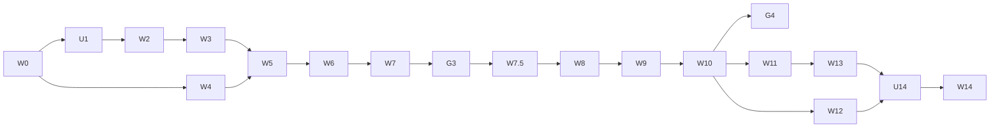

# 작업계획서 — 독서 기록 관리 웹앱

> 최종 수정: 2026-07-30 · 대상 기획: [PRD.md](PRD.md) v0.2
> 이 문서는 **실행 문서**다. 각 작업 단위(W번호)를 에이전트 1세션에서 처리하고, 완료 조건(DoD)을 스스로 검증한 뒤 다음 단위로 넘어간다.

---

## 1. 작업 단위 분할 원칙

1. **1 단위 = 1 에이전트 세션 = 1 브랜치 = 1 리뷰 가능한 커밋 묶음.** 세션 간 인수인계는 대화 기억이 아니라 이 문서와 PRD로만 이뤄진다. 새 세션이 이 문서만 읽고 시작할 수 있어야 한다.
2. **모든 단위는 "확인 가능한 상태"로 끝난다.** 빌드가 통과하고, 화면에서 뭔가 달라진 것이 보이거나 테스트가 통과한다. 화면·테스트 둘 다 없는 단위는 쪼개기를 잘못한 것이다.
3. **스키마 변경은 다른 작업과 섞지 않는다.** 마이그레이션은 되돌리기 비용이 가장 큰 변경이라 항상 독립 단위로 두고 컨펌을 받는다.
4. **자격증명은 절대 에이전트가 만들지 않는다.** 계정 생성·키 발급·비밀번호 입력은 전부 사용자 작업 단위(U번호)로 분리했다.
5. **범위 밖 판단이 필요해지면 멈춘다.** 스키마 변경, 새 의존성 추가, PRD에 없는 기능, 외부로 나가는 행위(배포·이메일 발송)는 단위 범위를 벗어나면 진행하지 않고 보고한다.

## 2. 검증 레벨

각 단위의 DoD는 아래 레벨을 조합해 정의한다. 상위 레벨은 하위 레벨을 포함한다.

| 레벨   | 이름        | 방법                                                                           | 누가              |
| ------ | ----------- | ------------------------------------------------------------------------------ | ----------------- |
| **V1** | 정적 검증   | `pnpm typecheck` · `pnpm lint` · `pnpm build` 전부 통과                        | 에이전트          |
| **V2** | 단위 테스트 | Vitest. 순수 로직(상태 전이 규칙, 진행률 계산, Zod 스키마, 통계 집계)만 대상   | 에이전트          |
| **V3** | 통합 검증   | 실제 DB 왕복 스크립트. insert → select → 기대값 비교. **RLS 차단 테스트 포함** | 에이전트          |
| **V4** | E2E 스모크  | Playwright. 로그인은 서비스 롤 키로 세션을 주입해 매직링크 단계를 우회         | 에이전트          |
| **V5** | 육안 확인   | 브라우저에서 실제 조작. 스크린샷을 남긴다                                      | 에이전트 → 사용자 |

## 3. 컨펌 게이트

에이전트가 **멈추고 사용자 답을 기다려야 하는** 지점. 이유가 셋 중 하나에 해당할 때만 게이트를 둔다: ⓐ자격증명 ⓑ되돌리기 비싼 결정 ⓒ취향 판단.

| 게이트 | 위치            | 이유 | 사용자가 할 일                                                                                               |
| ------ | --------------- | ---- | ------------------------------------------------------------------------------------------------------------ |
| **G0** | W0 후           | ⓐ    | Supabase 프로젝트·카카오 앱 생성, 키를 `.env.local`에 기입                                                   |
| **G1** | W2 실행 **전**  | ⓑ    | 마이그레이션 SQL 리뷰 후 적용 승인. 이후 스키마 변경은 데이터 마이그레이션을 동반한다                        |
| **G2** | W3 후           | ⓐ    | 실제 메일로 매직링크 로그인 1회 성공 확인 (이메일 수신은 대행 불가)                                          |
| **G3** | W7 후           | ⓒ    | **실사용 컨펌.** 본인 책 3권을 등록→기록→완독까지 직접 해보고 불편한 점 피드백. 핵심 루프 UX를 여기서 고친다 |
| **G4** | W10 후          | ⓒ    | 서재·대시보드 레이아웃과 차트 육안 확인                                                                      |
| **G5** | W14 실행 **전** | ⓑ    | 배포 승인 + Vercel 연결·환경변수 입력 (외부 공개는 되돌리기 어려움)                                          |

**G3가 이 계획의 핵심입니다.** 여기까지 오면 앱이 실제로 쓸 만한지 판단할 수 있고, 이후 분류·통계 작업의 방향이 실사용 감각에 따라 바뀔 수 있습니다. G3 전에 W8~W14를 미리 만들지 않는 이유입니다.

---

## 4. 작업 단위

크기: **S** ≈ 1세션 내 여유, **M** ≈ 1세션 꽉, **L** ≈ 쪼갤 여지 있음(막히면 분할)

### Phase A — 기반

| ID     | 작업                             | 선행 | 크기 | 산출물                                                                                                                                                                                                                                                     | DoD                                                                                                  |
| ------ | -------------------------------- | ---- | ---- | ---------------------------------------------------------------------------------------------------------------------------------------------------------------------------------------------------------------------------------------------------------- | ---------------------------------------------------------------------------------------------------- |
| **W0** | 저장소·툴체인 셋업               | —    | S    | `git init`, Next.js 16(App Router)+TS, Tailwind v4, shadcn/ui 초기화, ESLint·Prettier, Vitest·Playwright 설정, `.env.example`, `.gitignore`(`.env.local` 포함 확인), `pnpm` 스크립트(`dev`/`build`/`typecheck`/`lint`/`test`)                              | V1 + 루트 페이지가 `pnpm dev`에서 렌더                                                               |
| **U1** | 🔑 **[사용자]** 외부 서비스 준비 | W0   | —    | Supabase 프로젝트 생성 → `NEXT_PUBLIC_SUPABASE_URL`, `NEXT_PUBLIC_SUPABASE_ANON_KEY`, `SUPABASE_SERVICE_ROLE_KEY` / 카카오 개발자 앱 생성 → `KAKAO_REST_API_KEY`. 4개를 `.env.local`에 기입                                                                | **G0** — 값이 채워졌음을 사용자가 확인                                                               |
| **W2** | DB 스키마·마이그레이션           | U1   | M    | `supabase/migrations/0001_init.sql`(테이블 11 + 제약 + RLS 정책 12), 가입 트리거(profile 생성 + 분야 프리셋 12종 **사용자별 복사**), `record_progress()` RPC, `src/types/database.ts`(생성 타입), `supabase` devDependency + `db:push`·`db:types` 스크립트 | **G1**(적용 전 SQL 리뷰) → 적용 후 V3: 각 테이블 CRUD 왕복 + **타 사용자 토큰으로 접근 시 0행** 확인 |
| **W3** | 인증·세션                        | W2   | M    | 매직링크 로그인 페이지, `middleware.ts` 세션 갱신, 서버/클라이언트 Supabase 클라이언트 팩토리, 보호 라우트. **DB 객체는 없다** — `auth.users` → `profiles` 트리거는 W2로 이동했다                                                                          | V1+V2, V4(세션 주입 로그인) → **G2**(사용자 실제 로그인 1회)                                         |

### Phase B — 핵심 루프 (→ G3)

| ID       | 작업                            | 선행    | 크기 | 산출물                                                                                                                                                                                             | DoD                                                                        |
| -------- | ------------------------------- | ------- | ---- | -------------------------------------------------------------------------------------------------------------------------------------------------------------------------------------------------- | -------------------------------------------------------------------------- |
| **W4**   | 카카오 검색 프록시              | W0 · U1 | S    | `app/api/book-search/route.ts` — 서버에서만 키 사용, Zod 응답 파싱, 동일 쿼리 캐시, 쿼터 초과·장애 시 구조화된 에러 반환                                                                           | V1+V2(응답 모킹 파싱 테스트) + 실제 쿼리 1회 성공 로그. **W2와 병렬 가능** |
| **W5**   | 도서 등록·수정·삭제 + 상태 전이 | W3 · W4 | L    | `/books/new`(검색↔수동 토글, 형태 기본=전자책), `/books/[id]`, 서버 액션 + Zod, **상태 전이 규칙을 순수 함수로 분리**(`lib/reading-status.ts`), 전이 시 날짜 자동 기록                             | V1+V2(전이 규칙 전수 테스트: 허용/금지 조합)+V3+V4(등록→상세 진입)         |
| **W6**   | 진행률 기록                     | W5      | M    | 진행 기록 폼(전자책 %, 종이책 페이지 자동 분기), 대시보드 빠른 기록(인라인 입력+낙관적 업데이트), 진행 타임라인, `progress_logs` insert와 `readings.current_value` 갱신을 **단일 RPC로 원자 처리** | V1+V2(퍼센트 계산·역행 입력 방어)+V3(RPC 호출 후 두 테이블 정합성)+V5      |
| **W7**   | 완독 처리·소감·인용구           | W6      | M    | 완독 모달(별점 0.5단위 + 평문 소감 500자, 한 화면), `finished_at` 자동 기록, 인용구 CRUD(위치=페이지 또는 %), 즐겨찾기                                                                             | V1+V2(500자 경계, 별점 범위)+V3+V5 → **G3 실사용 컨펌**                    |
| **W7.5** | G3 피드백 반영                  | G3      | S~L  | 사용자 피드백에 따른 핵심 루프 수정. **범위는 G3 결과를 보고 확정**                                                                                                                                | V1 + 지적된 항목별 재확인                                                  |

### Phase C — 분류·탐색·통계

| ID      | 작업                | 선행 | 크기 | 산출물                                                                                                                                                                    | DoD                                            |
| ------- | ------------------- | ---- | ---- | ------------------------------------------------------------------------------------------------------------------------------------------------------------------------- | ---------------------------------------------- |
| **W8**  | 분야·태그·서재 관리 | W7.5 | M    | 분야 선택(단일)·추가·색상, 태그 자유 입력(자동완성·병합), 서재 CRUD 및 책 담기, `/settings`의 분류 관리 화면                                                              | V1+V2+V3+V5                                    |
| **W9**  | 서재 목록·필터·검색 | W8   | M    | `/library` — 상태 탭, 분야·태그·별점·연도 필터, 키워드 검색, 정렬 4종, 그리드/리스트 뷰, 리스트 뷰에 소감 전문 노출. **전량 로드 + 클라이언트 필터링**(페이지네이션 없음) | V1+V2(필터·정렬 조합 로직)+V4+V5               |
| **W10** | 대시보드·통계·목표  | W9   | L    | 통계 집계 SQL view, Recharts 도넛·바, 스트릭, 총 독서 시간, 목표 설정(권수/분)·게이지, 읽는 중 카드                                                                       | V1+V2(집계 결과 검증)+V3+V5 → **G4 육안 확인** |

### Phase D — 마감·배포

| ID      | 작업                      | 선행    | 크기 | 산출물                                                                                                                  | DoD                                                 |
| ------- | ------------------------- | ------- | ---- | ----------------------------------------------------------------------------------------------------------------------- | --------------------------------------------------- |
| **W11** | 다크모드·반응형·접근성    | W10     | M    | OS 테마 연동 + 토글, 모바일(375px)~데스크톱 레이아웃 점검, 키보드 포커스·`aria` 보완, 표지 이미지 `remotePatterns` 정리 | V1+V5(모바일/데스크톱 × 라이트/다크 4조합 스크린샷) |
| **W12** | 백업 내보내기·가져오기    | W10     | S    | 전체 JSON 내보내기, 가져오기(중복 ISBN 처리 정책 포함), 완독 목록 CSV                                                   | V1+V2+V3(내보내기→비우기→가져오기 후 동일성 검증)   |
| **W13** | PWA                       | W11     | S    | manifest, 아이콘, 서비스워커(읽기 전용 캐시), 홈 화면 추가                                                              | V1+V5(모바일 설치 확인)                             |
| **U14** | 🔑 **[사용자]** 배포 준비 | W11~W13 | —    | Vercel 프로젝트 연결, 환경변수 4개 입력, Supabase Auth 리다이렉트 URL에 배포 도메인 등록                                | **G5** — 배포 승인                                  |
| **W14** | 배포·검증                 | U14     | S    | 프로덕션 빌드 배포, 배포 환경 스모크(로그인→등록→기록→완독)                                                             | V4 on production + V5                               |

### v1.1 백로그 (별도 계획으로 재분할)

| ID  | 작업                           | 비고                                                                           |
| --- | ------------------------------ | ------------------------------------------------------------------------------ |
| W15 | 독서 타이머 (F13)              | 탭 종료 후에도 유지되는 상태 관리가 핵심 난점                                  |
| W16 | 독서 히트맵 (F14)              | W10 통계 view 재사용                                                           |
| W17 | **알라딘 페이지수 검증** (F19) | 실응답을 찍어보고 페이지수 필드가 없으면 연동 폐기 확정. 검증 자체는 30분 작업 |
| W18 | 반납일 알림 (F17)              |                                                                                |
| W19 | 통계 심화 (F18)                |                                                                                |
| W20 | ISBN 바코드 스캔 (F20)         | 종이책 등록용, 우선순위 중간                                                   |

---

## 5. 의존 관계



병렬 가능한 조합은 **W2 ∥ W4**, **W12 ∥ W13** 둘뿐이다. 나머지는 앞 단위의 산출물을 직접 쓴다. 병렬로 돌릴 때는 워크트리를 분리해 같은 파일을 두 세션이 건드리지 않게 한다.

---

## 6. 에이전트 실행 규약

각 단위를 에이전트에 넘길 때 아래를 그대로 적용한다.

### 6.1 세션 시작 시

1. `docs/PRD.md`의 해당 절과 `docs/WORKPLAN.md`의 자기 단위 행을 읽는다.
2. `git switch -c feat/W<번호>-<슬러그>` 로 브랜치를 만든다.
3. 직전 단위의 산출물이 실제로 존재하는지 확인한다(선행 단위가 끝났다는 말을 믿지 않는다).

### 6.2 세션 종료 시 보고 형식

```
## W<번호> 완료 보고
- 변경 파일: (목록)
- DoD 검증 결과:
  - V1: pnpm typecheck ✅ / lint ✅ / build ✅   ← 실제 출력 첨부
  - V2: 12 passed                              ← 실제 출력 첨부
  - V3: (스크립트명) 통과 / RLS 차단 확인
- 범위 밖으로 남긴 것:
- 다음 단위가 알아야 할 사항:
```

### 6.3 금지·중단 규칙

- **테스트 실패를 숨기지 않는다.** 통과시키려고 단정 조건을 약화시키거나 테스트를 스킵하는 것은 금지. 실패하면 실패 출력을 붙여 보고한다.
- 아래를 만나면 **작업을 멈추고 보고**한다: 스키마 변경 필요 / PRD에 없는 기능 필요 / 새 런타임 의존성 추가 / `.env.local` 값 부재 / 외부로 나가는 행위(배포·메일 발송·공개 저장소 푸시).
- 키 값을 코드·커밋·로그에 넣지 않는다. `.env.local`은 커밋 대상이 아니다.
- 커밋은 단위 안에서 논리적으로 쪼개고, 메시지는 `W<번호>: <무엇을>` 형식.

### 6.4 마이그레이션 취급

- 마이그레이션은 항상 **파일로 버전관리**(`supabase/migrations/`)하고 손으로 콘솔 SQL 에디터를 쓰지 않는다. 콘솔에서 직접 바꾸면 다음 세션이 스키마 상태를 알 수 없다.
- 개발 초기에는 데이터가 없으므로 문제가 되면 리셋이 가장 빠르다. **G3에서 실제 데이터를 넣기 시작한 시점부터는 리셋 금지**, 이후 스키마 변경은 up 마이그레이션 + 데이터 이행으로만.
- 로컬 Supabase(Docker)는 이 프로젝트 규모에 과하다. 원격 개발 프로젝트 하나에 `supabase db push`로 진행하고, 필요해지면 그때 로컬을 붙인다.

---

## 7. 리스크

| 리스크                            | 징후                          | 대응                                                                                 |
| --------------------------------- | ----------------------------- | ------------------------------------------------------------------------------------ |
| G3에서 핵심 루프를 크게 고치게 됨 | 등록·기록이 번거롭다는 피드백 | 의도된 설계다. W8 이후를 G3 전에 만들지 않아 손실을 W7.5로 한정                      |
| 매직링크 이메일이 스팸함으로 감   | G2에서 메일 미수신            | Supabase 기본 SMTP는 제한이 있다. 막히면 커스텀 SMTP 연결을 U1에 추가                |
| 카카오 검색에 원하는 책이 없음    | 전자책 전용·독립출판물        | 수동 등록 폼이 MVP에 있으므로 등록 자체는 막히지 않는다                              |
| E2E가 매직링크 때문에 자동화 불가 | W3에서 Playwright 막힘        | 서비스 롤 키로 세션 주입(V4 정의). 이 우회가 안 되면 E2E를 W5까지 미루고 V3으로 대체 |
| 단위가 1세션에 안 들어감          | W5·W10이 후보                 | L 표시된 단위는 막히는 즉시 분할하고 이 문서를 갱신한다                              |

---

## 8. 진행 체크리스트

- [x] W0 저장소·툴체인 셋업
- [x] U1 🔑 외부 서비스 준비 → **G0** 통과
- [x] W2 DB 스키마·마이그레이션 → **G1** 통과 · V3 34/34 · 원격 적용 완료
- [x] W3 인증·세션 — V1 · V2 · V4 9개 → **G2 통과**(실제 메일 로그인 확인)
- [x] W4 카카오 검색 프록시 — V1 · V2 45개 · 실검색 확인
- [x] W5 도서 등록·상태 전이 — V1 · V2 134개 · V3 39개 · V4 16개
- [x] W6 진행률 기록 — V1 · V2 166개 · V3 44개 · V4 21개
- [x] W7 완독·소감·인용구 — V1 · V2 204개 · V3 44개 · V4 26개 → **G3 통과**
- [x] W7.5 G3 피드백 반영 — 디자인 컨셉("서재") · 폰트·다크모드 정상화 · 삭제 확인 · 진행률 단위 변경. V1 · V2 215개 · V3 44개 · V4 27개 · V5
- [x] W8 분야·태그·서재 — V1 · V2 256개 · V3 65개 · V4 37개 · V5
- [x] W9 서재 목록·필터 — V1 · V2 302개 · V3 65개 · V4 46개 · V5
- [x] W10 대시보드·통계·목표 — V1 · V2 366개 · V3 77개 · V4 56개 · V5 → **G4 육안 확인 대기**
- [x] W11 다크모드·반응형·접근성 — V1 · V2 377개 · V3 77개 · V4 64개 · V5 4조합
- [x] W12 백업 내보내기·가져오기 — V1 · V2 413개 · V3 87개 · V4 70개
- [ ] W13 PWA
- [ ] U14 🔑 배포 준비 → **G5**
- [ ] W14 배포·검증
